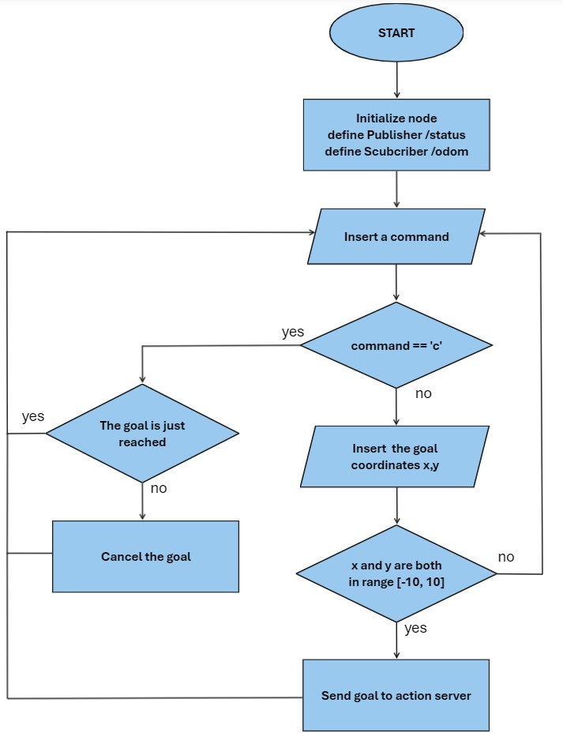

 # Research Track 1, Assignment 2
Second assignment of Research Track 1 course at UniGe Robotics Engineering.

## Introduction
This assignment entails the development of three ROS (Robot Operating System) nodes to maneuver a robot in a simulated 3D environment. The main node is designed for user interaction, allowing the specification and cancellation of target coordinates for the robot. Then, two service node are required, the first one is dedicated to showing the coordinates of the last target sent by the user, while the other service node has to calculate and report the distance of the robot from its target and its average speed. We used Rviz and Gazebo for the simulation.


### Simulator
For this assignment, it was used Gazebo and Rviz within ROS. Gazebo served as the 3D simulation environment to test and refine the robot's movements, while Rviz was used for detailed 3D visualization, with also the information of the robot's sensor.

## Installing and running
First of all, you need to install xterm for the terminal interface
```bash
sudo apt-get install xterm
```

Then, clone the repository to your machine (or download)
```bash
git clone https://github.com/NicolasBravi01/RT1_assignment2.git
```
Before running, make the python files in the 'scripts' folder executable
```bash
cd scripts
chmod +x *.py
```

Now it is possible to run
```bash
roslaunch assignment_2_2023 assignment1.launch
```


## Nodes description
We just have provided theese nodes:
  - `bug_as.py`: Action server which implements the bug0 algorithm.
  - `wall_follow_service.py `: Service node that makes the robot follow the wall if it meets an obstacle.
  - `go_to_point_service.py `: Service node that makes the robot go straight to the goal position.

### `action_client.py`
This node is an action client and it allows the user to set a new goal to reach or cancel the current one through console input. Before doing any action, the user has to type a command in order to choose what to do, if he types `c` the goal is going to be cancelled, else if he types anything else he can proceed to set the new position goal through the coordinates `x,y` which must be in the interval `[-10, 10]`. To cancel the goal, it is necessary that the robot has not reached it yet. The other task of this node is to publish the robot position and velocity as a custom message. With the callback function of the subscriber `/odom` it is possible to get those information and we publish them through the publisher called `/status`. Below it is possible to see the Flowchart:




### `last_target.py`
This node is a service node that returns the coordinates of the last target sent by the user through the `action_client.py`. It was possible with the service `/last_input` defined in the folder `srv`. With the callback functions of this service we get the value of the parameters `des_pos_x` and `des_pos_y`. They represent the last goal set by the user and we return them as the response of the service request `/last_input`. It is possible to call this service with the command:

`rosservice call /last_input`


### `dis_avg.py`
Also this node is a service node, it has the purpose to calculate the distance of the robot from the target and the robot's average speed along x-axis (linear) and z-axis (angular). We use the custom message `/status` defined in the `action_client.py` node. This time it is used as a subscriber and it is possible to get information about the current position `x, y` and velocity `v_x, v_z` throgh its callback function. In order to calculate the average, the velocities are saved in a list of the dimension of the param `window_size` specified in the `assigment1.launch` file (now set as 10) and when the number of elements in the list reach that limit, we remove the oldest value added.

The other callback function refers to the service `/dist_avg` in which we calculate the distance from the robot to the goal, knowing the target and current robot position, and the average of the speed along x-axis and z-axis. We return them as the response of the service request `/dist_avg`. It is possible to call this service with the command:

`rosservice call /dist_avg`


## AUTOR
[Nicolas Bravi](https://github.com/NicolasBravi01)


